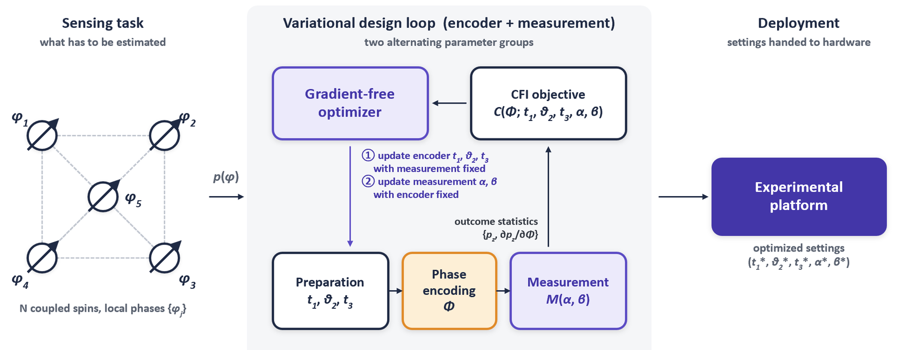

# priyam1498.github.io

Static multi-page site. No build step, no dependencies.

## Files to put in the repo root

    index.html          About: interests, background, education, recent news
    research.html       Two research threads, interactive explainer, earlier projects
    publications.html   All seven papers, filterable by topic
    cv.html             Skills, grants, talks, teaching, service, CV download
    styles.css          All styling. REPLACE the old file completely.
    site.js             Theme toggle, publication filters, explorer plot
    assets/favicon.svg

## Delete from the repo

    hobbies.html        Content moved into index.html

## Add to assets/

    CV_Priyam_Srivastava.pdf    Linked from index.html and cv.html
    fig-metrology.png           Research figure, roughly 4:3
    fig-rl.png                  Research figure, roughly 4:3
    og-card.png                 1200x630 link preview image, optional

## Swapping in the research figures

Each thread in research.html has a placeholder:

    
assets/fig-metrology.png

Replace it with:

    

Export at about 720x540 so it stays sharp on retina screens, under 200 KB.

## Editing

Navigation is repeated in the header of all four pages. To add a page, copy the
header block and add the link in all four, marking the current page with
class="on".

Colors live in the :root, [data-theme='dark'], and [data-theme='light'] blocks
at the top of styles.css. Teal marks the sensing thread, plum the networks
thread.

## Theme

Dark by default, toggle in the header, choice saved in localStorage, first-time
visitors get their system preference.
